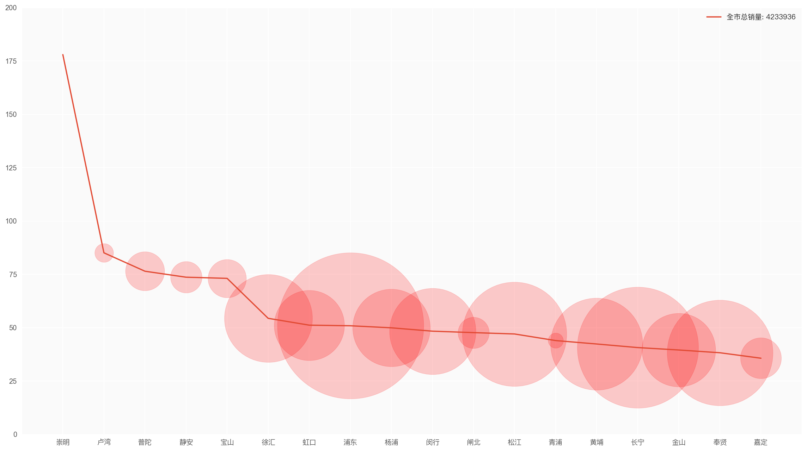

<h1>
上海市各下辖区文娱与个人服务价格调研：美团爬虫数据初步分析 撰写人：汪洋
</h1>

  

经过初步的筛选，我们总结了十项具体服务，同时满足以下三条标准：

- 文娱生活：该服务属于大多数中产阶级日常涉及的文娱与个人服务；
- 较为普遍：该服务在美团上的总销量为对应子类别前五；
- 跨省可比：该服务不是上海特有的。

以下所有数据于2017年7月3日采集自美团网。

---

**1. KTV（3小时）**

<table border="1" class="dataframe">
  <thead>
    <tr style="text-align: center;">
      <th></th>
      <th>商家</th>
      <th>区域</th>
      <th>商圈</th>
      <th>星级</th>
      <th>服务</th>
      <th>价格</th>
      <th>销量</th>
      <th>营收</th>
    </tr>
  </thead>
  <tbody>
    <tr style="text-align:center;">
      <th>1</th>
      <td>超级玛丽KTV（高桥店）</td>
      <td>浦东</td>
      <td>外高桥</td>
      <td>5.0</td>
      <td>周一至周日6:00-18:00三小时欢唱套餐</td>
      <td>19.9</td>
      <td>16452</td>
      <td>327394.8</td>
    </tr>
    <tr style="text-align:center;">
      <th>2</th>
      <td>唛酷量贩ktv</td>
      <td>松江</td>
      <td>松东路</td>
      <td>5.0</td>
      <td>周一至周日黄金档3小时欢唱套餐</td>
      <td>30.0</td>
      <td>12650</td>
      <td>379500.0</td>
    </tr>
    <tr style="text-align:center;">
      <th>3</th>
      <td>超级玛丽KTV（周浦店）</td>
      <td>浦东</td>
      <td>迪士尼</td>
      <td>4.7</td>
      <td>周一至周日全时间段3小时欢唱</td>
      <td>33.0</td>
      <td>7987</td>
      <td>263571.0</td>
    </tr>
    <tr style="text-align:center;">
      <th>4</th>
      <td>讴K拉（大华店）</td>
      <td>宝山</td>
      <td>大华地区</td>
      <td>5.0</td>
      <td>周一至周日白天档3小时欢唱券</td>
      <td>32.0</td>
      <td>6626</td>
      <td>212032.0</td>
    </tr>
    <tr style="text-align:center;">
      <th>5</th>
      <td>欢歌ktv（浦江店）</td>
      <td>闵行</td>
      <td>浦江镇</td>
      <td>4.7</td>
      <td>周一至周五白天档3小时欢唱</td>
      <td>39.9</td>
      <td>5089</td>
      <td>203051.1</td>
    </tr>
    <tr style="text-align:center;">
      <th>...</th>
      <td>...</td>
      <td>...</td>
      <td>...</td>
      <td>...</td>
      <td>...</td>
      <td>...</td>
      <td>...</td>
      <td>...</td>
    </tr>
    <tr style="text-align:center;">
      <th>51</th>
      <td>王子公主奇遇记主题KTV（金玉兰广场店）</td>
      <td>卢湾</td>
      <td>打浦桥</td>
      <td>5.0</td>
      <td>周一至周五白天档3小时欢唱券+蜜豆蛋糕卷一份</td>
      <td>149.0</td>
      <td>94</td>
      <td>14006.0</td>
    </tr>
    <tr style="text-align:center;">
      <th>52</th>
      <td>唛动纯K（周浦店）</td>
      <td>浦东</td>
      <td>迪士尼</td>
      <td>5.0</td>
      <td>周一至周日全时段欢唱3小时+酒水套餐</td>
      <td>188.0</td>
      <td>93</td>
      <td>17484.0</td>
    </tr>
    <tr style="text-align:center;">
      <th>53</th>
      <td>巴黎纯k</td>
      <td>奉贤</td>
      <td>西渡镇</td>
      <td>5.0</td>
      <td>黄金档3小时小包欢唱套餐</td>
      <td>168.0</td>
      <td>21</td>
      <td>3528.0</td>
    </tr>
    <tr style="text-align:center;">
      <th>54</th>
      <td>宝乐迪量贩ktv</td>
      <td>浦东</td>
      <td>航头</td>
      <td>4.8</td>
      <td>周五至周日阳光档小包3小时欢唱券</td>
      <td>60.0</td>
      <td>19</td>
      <td>1140.0</td>
    </tr>
    <tr style="text-align:center;">
      <th>55</th>
      <td>巨麦时尚KTV（中原城市广场店）</td>
      <td>杨浦</td>
      <td>中原地区</td>
      <td>4.5</td>
      <td>百龄坛特醇周日至周四3小时欢唱+酒水套餐</td>
      <td>488.0</td>
      <td>1</td>
      <td>488.0</td>
    </tr>
  </tbody>
</table>

55 rows × 8 columns

---

**2. 美容美体套餐（1次）**

<table border="1" class="dataframe">
  <thead>
    <tr style="text-align: center;">
      <th></th>
      <th>商家</th>
      <th>区域</th>
      <th>商圈</th>
      <th>星级</th>
      <th>服务</th>
      <th>价格</th>
      <th>销量</th>
      <th>营收</th>
    </tr>
  </thead>
  <tbody>
    <tr style="text-align:center;">
      <th>1</th>
      <td>美丽田园（日月光店）</td>
      <td>卢湾</td>
      <td>日月光中心广场</td>
      <td>5.0</td>
      <td>单人美白/保养/紧致/保湿SPA套餐四选一</td>
      <td>268.0</td>
      <td>13350</td>
      <td>3577800.0</td>
    </tr>
    <tr style="text-align:center;">
      <th>2</th>
      <td>美丽田园（大宁音乐广场店）</td>
      <td>闸北</td>
      <td>大宁国际</td>
      <td>5.0</td>
      <td>单人美白/保养/紧致/保湿SPA套餐四选一</td>
      <td>268.0</td>
      <td>13347</td>
      <td>3576996.0</td>
    </tr>
    <tr style="text-align:center;">
      <th>3</th>
      <td>美丽田园（永新店）</td>
      <td>徐汇</td>
      <td>徐家汇</td>
      <td>4.3</td>
      <td>单人美白/保养/紧致/保湿SPA套餐四选一</td>
      <td>268.0</td>
      <td>13350</td>
      <td>3577800.0</td>
    </tr>
    <tr style="text-align:center;">
      <th>4</th>
      <td>美丽田园（永新店）</td>
      <td>徐汇</td>
      <td>徐家汇</td>
      <td>4.3</td>
      <td>单人美白/保养/紧致/保湿SPA套餐四选一</td>
      <td>268.0</td>
      <td>13347</td>
      <td>3576996.0</td>
    </tr>
    <tr style="text-align:center;">
      <th>5</th>
      <td>美丽田园（花木店）</td>
      <td>浦东</td>
      <td>世纪公园</td>
      <td>5.0</td>
      <td>单人美白/保养/紧致/保湿SPA套餐四选一</td>
      <td>268.0</td>
      <td>13350</td>
      <td>3577800.0</td>
    </tr>
    <tr style="text-align:center;">
      <th>...</th>
      <td>...</td>
      <td>...</td>
      <td>...</td>
      <td>...</td>
      <td>...</td>
      <td>...</td>
      <td>...</td>
      <td>...</td>
    </tr>
    <tr style="text-align:center;">
      <th>3326</th>
      <td>Vita Spa（海仑宾馆店）</td>
      <td>黄埔</td>
      <td>人民广场/南京路</td>
      <td>3.5</td>
      <td>单人SPA按摩/美容保湿面护套餐</td>
      <td>268.0</td>
      <td>0</td>
      <td>0.0</td>
    </tr>
    <tr style="text-align:center;">
      <th>3327</th>
      <td>薇拉美颜纤体中心</td>
      <td>宝山</td>
      <td>宝山区</td>
      <td>4.0</td>
      <td>单人面部水氧肌护理一次</td>
      <td>158.0</td>
      <td>0</td>
      <td>0.0</td>
    </tr>
    <tr style="text-align:center;">
      <th>3328</th>
      <td>Angi美丽定制·韩式半永久（人民广场店）</td>
      <td>黄埔</td>
      <td>黄浦区</td>
      <td>5.0</td>
      <td>单人水氧清洁美肌套餐</td>
      <td>198.0</td>
      <td>0</td>
      <td>0.0</td>
    </tr>
    <tr style="text-align:center;">
      <th>3329</th>
      <td>悠香自然疗法家（上门服务）</td>
      <td>长宁</td>
      <td>古北</td>
      <td>3.5</td>
      <td>全身精油按摩（单人）</td>
      <td>298.0</td>
      <td>0</td>
      <td>0.0</td>
    </tr>
    <tr style="text-align:center;">
      <th>3330</th>
      <td>康宏瘦身工作室</td>
      <td>普陀</td>
      <td>长寿路</td>
      <td>5.0</td>
      <td>单人精油开背套餐</td>
      <td>98.0</td>
      <td>0</td>
      <td>0.0</td>
    </tr>
  </tbody>
</table>

3330 rows × 8 columns

---

**3. 健身房月卡**

<table border="1" class="dataframe">
  <thead>
    <tr style="text-align: center;">
      <th></th>
      <th>商家</th>
      <th>区域</th>
      <th>商圈</th>
      <th>星级</th>
      <th>服务</th>
      <th>价格</th>
      <th>销量</th>
      <th>营收</th>
    </tr>
  </thead>
  <tbody>
    <tr style="text-align:center;">
      <th>1</th>
      <td>星之健身（长宁店）</td>
      <td>长宁</td>
      <td>天山</td>
      <td>3.5</td>
      <td>单人记名健身月卡</td>
      <td>188.0</td>
      <td>427</td>
      <td>80276.0</td>
    </tr>
    <tr style="text-align:center;">
      <th>2</th>
      <td>星之健身（陆家嘴店）</td>
      <td>浦东</td>
      <td>陆家嘴</td>
      <td>5.0</td>
      <td>单人记名健身月卡</td>
      <td>188.0</td>
      <td>427</td>
      <td>80276.0</td>
    </tr>
    <tr style="text-align:center;">
      <th>3</th>
      <td>星之健身（龙柏店）</td>
      <td>闵行</td>
      <td>龙柏地区</td>
      <td>3.5</td>
      <td>单人记名健身月卡</td>
      <td>188.0</td>
      <td>427</td>
      <td>80276.0</td>
    </tr>
    <tr style="text-align:center;">
      <th>4</th>
      <td>星之健身（卢湾店）</td>
      <td>徐汇</td>
      <td>徐家汇/肇嘉浜路沿线</td>
      <td>3.5</td>
      <td>单人记名健身月卡</td>
      <td>188.0</td>
      <td>427</td>
      <td>80276.0</td>
    </tr>
    <tr style="text-align:center;">
      <th>5</th>
      <td>星之健身（张江店）</td>
      <td>浦东</td>
      <td>张江</td>
      <td>5.0</td>
      <td>单人记名健身月卡</td>
      <td>188.0</td>
      <td>427</td>
      <td>80276.0</td>
    </tr>
    <tr style="text-align:center;">
      <th>...</th>
      <td>...</td>
      <td>...</td>
      <td>...</td>
      <td>...</td>
      <td>...</td>
      <td>...</td>
      <td>...</td>
      <td>...</td>
    </tr>
    <tr style="text-align:center;">
      <th>71</th>
      <td>TWM-Fitness运动生活馆（世纪店）</td>
      <td>浦东</td>
      <td>世纪公园</td>
      <td>5.0</td>
      <td>TWM单人月卡体验</td>
      <td>188.0</td>
      <td>2</td>
      <td>376.0</td>
    </tr>
    <tr style="text-align:center;">
      <th>72</th>
      <td>Liking Fit智能健身（曹家渡店）</td>
      <td>静安</td>
      <td>曹家渡</td>
      <td>3.5</td>
      <td>单人健身不限时段月卡</td>
      <td>299.0</td>
      <td>1</td>
      <td>299.0</td>
    </tr>
    <tr style="text-align:center;">
      <th>73</th>
      <td>东部骑士健身Eastern Riders Fitness</td>
      <td>卢湾</td>
      <td>打浦桥</td>
      <td>5.0</td>
      <td>个人月套餐</td>
      <td>288.0</td>
      <td>1</td>
      <td>288.0</td>
    </tr>
    <tr style="text-align:center;">
      <th>74</th>
      <td>氪石健身工作室</td>
      <td>松江</td>
      <td>松江万达广场</td>
      <td>4.0</td>
      <td>私教体验月卡（一个月内不限次数</td>
      <td>2800.0</td>
      <td>0</td>
      <td>0.0</td>
    </tr>
    <tr style="text-align:center;">
      <th>75</th>
      <td>DEFGROUP拳击巴西柔术综合运动馆</td>
      <td>闵行</td>
      <td>七宝</td>
      <td>4.5</td>
      <td>单人首月单项课程卡</td>
      <td>799.0</td>
      <td>0</td>
      <td>0.0</td>
    </tr>
  </tbody>
</table>

75 rows × 8 columns

---

**4. 推拿（45分钟）**

<table border="1" class="dataframe">
  <thead>
    <tr style="text-align: center;">
      <th></th>
      <th>商家</th>
      <th>区域</th>
      <th>商圈</th>
      <th>星级</th>
      <th>服务</th>
      <th>价格</th>
      <th>销量</th>
      <th>营收</th>
    </tr>
  </thead>
  <tbody>
    <tr style="text-align:center;">
      <th>1</th>
      <td>天泽足道（西藏北路店）</td>
      <td>闸北</td>
      <td>北区汽车站</td>
      <td>4.6</td>
      <td>单人木桶浴精油油压按摩</td>
      <td>178.0</td>
      <td>42298</td>
      <td>7529044.0</td>
    </tr>
    <tr style="text-align:center;">
      <th>2</th>
      <td>雅然足道（宝山路店）</td>
      <td>闸北</td>
      <td>西藏北路/中兴路</td>
      <td>4.6</td>
      <td>单人木桶浴精油油压按摩</td>
      <td>178.0</td>
      <td>42298</td>
      <td>7529044.0</td>
    </tr>
    <tr style="text-align:center;">
      <th>3</th>
      <td>天泽足道（茭白原路店）</td>
      <td>杨浦</td>
      <td>控江地区</td>
      <td>5.0</td>
      <td>单人木桶浴精油油压按摩</td>
      <td>178.0</td>
      <td>42298</td>
      <td>7529044.0</td>
    </tr>
    <tr style="text-align:center;">
      <th>4</th>
      <td>天泽足道（国权东路店）</td>
      <td>杨浦</td>
      <td>黄兴公园</td>
      <td>5.0</td>
      <td>单人木桶浴精油油压按摩</td>
      <td>178.0</td>
      <td>42298</td>
      <td>7529044.0</td>
    </tr>
    <tr style="text-align:center;">
      <th>5</th>
      <td>天泽足道（政本路店）</td>
      <td>杨浦</td>
      <td>五角场/大学区</td>
      <td>5.0</td>
      <td>单人木桶浴精油油压按摩</td>
      <td>178.0</td>
      <td>42298</td>
      <td>7529044.0</td>
    </tr>
    <tr style="text-align:center;">
      <th>...</th>
      <td>...</td>
      <td>...</td>
      <td>...</td>
      <td>...</td>
      <td>...</td>
      <td>...</td>
      <td>...</td>
      <td>...</td>
    </tr>
    <tr style="text-align:center;">
      <th>910</th>
      <td>廖氏足道</td>
      <td>宝山</td>
      <td>顾村公园</td>
      <td>3.0</td>
      <td>单人专业推拿</td>
      <td>49.0</td>
      <td>0</td>
      <td>0.0</td>
    </tr>
    <tr style="text-align:center;">
      <th>911</th>
      <td>康康推拿</td>
      <td>虹口</td>
      <td>曲阳地区</td>
      <td>3.5</td>
      <td>全身推拿套餐</td>
      <td>85.0</td>
      <td>0</td>
      <td>0.0</td>
    </tr>
    <tr style="text-align:center;">
      <th>912</th>
      <td>修剪拾光护肤造型沙龙（四平路店）</td>
      <td>虹口</td>
      <td>临平路/和平公园</td>
      <td>5.0</td>
      <td>单人洗发按摩套餐</td>
      <td>100.0</td>
      <td>0</td>
      <td>0.0</td>
    </tr>
    <tr style="text-align:center;">
      <th>913</th>
      <td>玛斯帝雅健康生活馆（宛平南路店）</td>
      <td>徐汇</td>
      <td>徐汇区</td>
      <td>5.0</td>
      <td>玛斯帝雅单人古希腊宫廷推拿调理</td>
      <td>108.0</td>
      <td>0</td>
      <td>0.0</td>
    </tr>
    <tr style="text-align:center;">
      <th>914</th>
      <td>安逸扦脚屋</td>
      <td>宝山</td>
      <td>大华地区</td>
      <td>4.6</td>
      <td>小儿推拿</td>
      <td>70.0</td>
      <td>0</td>
      <td>0.0</td>
    </tr>
  </tbody>
</table>

914 rows × 8 columns

---

**5. 单人浴资券（1张）**

<table border="1" class="dataframe">
  <thead>
    <tr style="text-align: center;">
      <th></th>
      <th>商家</th>
      <th>区域</th>
      <th>商圈</th>
      <th>星级</th>
      <th>服务</th>
      <th>价格</th>
      <th>销量</th>
      <th>营收</th>
    </tr>
  </thead>
  <tbody>
    <tr style="text-align:center;">
      <th>1</th>
      <td>绿岛汗蒸洗浴</td>
      <td>闸北</td>
      <td>大宁国际</td>
      <td>5.0</td>
      <td>（周一至周日）单人浴资券</td>
      <td>49.0</td>
      <td>52954</td>
      <td>2594746.0</td>
    </tr>
    <tr style="text-align:center;">
      <th>2</th>
      <td>清潭洞SPA汗蒸馆</td>
      <td>嘉定</td>
      <td>嘉定镇</td>
      <td>5.0</td>
      <td>（周一至周四）单人浴资券</td>
      <td>49.0</td>
      <td>52706</td>
      <td>2582594.0</td>
    </tr>
    <tr style="text-align:center;">
      <th>3</th>
      <td>清溪川韩浴</td>
      <td>松江</td>
      <td>松江大学城</td>
      <td>5.0</td>
      <td>(周五到周日）单人成人浴资券</td>
      <td>69.0</td>
      <td>43873</td>
      <td>3027237.0</td>
    </tr>
    <tr style="text-align:center;">
      <th>4</th>
      <td>南美水疗（南汇店）</td>
      <td>浦东</td>
      <td>浦东新区</td>
      <td>5.0</td>
      <td>单人浴资1张</td>
      <td>38.0</td>
      <td>39243</td>
      <td>1491234.0</td>
    </tr>
    <tr style="text-align:center;">
      <th>5</th>
      <td>哈一顿桑拿</td>
      <td>闵行</td>
      <td>七宝</td>
      <td>5.0</td>
      <td>(周六至周日及法定节假日)单人浴资券</td>
      <td>78.0</td>
      <td>35719</td>
      <td>2786082.0</td>
    </tr>
    <tr style="text-align:center;">
      <th>...</th>
      <td>...</td>
      <td>...</td>
      <td>...</td>
      <td>...</td>
      <td>...</td>
      <td>...</td>
      <td>...</td>
      <td>...</td>
    </tr>
    <tr style="text-align:center;">
      <th>146</th>
      <td>Euse-SPA日本岩浴馆（腾飞广场店）</td>
      <td>徐汇</td>
      <td>万体馆</td>
      <td>5.0</td>
      <td>【初体验套餐】双人天然岩浴养生</td>
      <td>268.0</td>
      <td>1</td>
      <td>268.0</td>
    </tr>
    <tr style="text-align:center;">
      <th>147</th>
      <td>达令中医养生会所</td>
      <td>闵行</td>
      <td>七宝</td>
      <td>3.5</td>
      <td>单人草本浴</td>
      <td>198.0</td>
      <td>0</td>
      <td>0.0</td>
    </tr>
    <tr style="text-align:center;">
      <th>148</th>
      <td>聚元扶阳堂（局门店）</td>
      <td>卢湾</td>
      <td>打浦桥</td>
      <td>5.0</td>
      <td>单人特惠瑶浴体验</td>
      <td>498.0</td>
      <td>0</td>
      <td>0.0</td>
    </tr>
    <tr style="text-align:center;">
      <th>149</th>
      <td>摩雅国际水疗名店（普陀店）</td>
      <td>普陀</td>
      <td>普陀区</td>
      <td>3.5</td>
      <td>单人浴资体验券</td>
      <td>68.0</td>
      <td>0</td>
      <td>0.0</td>
    </tr>
    <tr style="text-align:center;">
      <th>150</th>
      <td>安然纳米汗蒸生活馆（青村店）</td>
      <td>奉贤</td>
      <td>奉贤区</td>
      <td>4.4</td>
      <td>汗蒸、调理、洗浴套餐</td>
      <td>38.0</td>
      <td>0</td>
      <td>0.0</td>
    </tr>
  </tbody>
</table>

150 rows × 8 columns

---

**6. 洗衣（1件）**

<table border="1" class="dataframe">
  <thead>
    <tr style="text-align: center;">
      <th></th>
      <th>商家</th>
      <th>区域</th>
      <th>商圈</th>
      <th>星级</th>
      <th>服务</th>
      <th>价格</th>
      <th>销量</th>
      <th>营收</th>
    </tr>
  </thead>
  <tbody>
    <tr style="text-align:center;">
      <th>1</th>
      <td>威能洗衣连锁（普陀店）</td>
      <td>嘉定</td>
      <td>丰庄</td>
      <td>3.5</td>
      <td>洗衣洗鞋一件 全市免费上门收送</td>
      <td>28.9</td>
      <td>4746</td>
      <td>137159.4</td>
    </tr>
    <tr style="text-align:center;">
      <th>2</th>
      <td>威能洗衣连锁（河南中路店）</td>
      <td>黄埔</td>
      <td>外滩</td>
      <td>3.5</td>
      <td>洗衣洗鞋一件 全市免费上门收送</td>
      <td>28.9</td>
      <td>4746</td>
      <td>137159.4</td>
    </tr>
    <tr style="text-align:center;">
      <th>3</th>
      <td>威能洗衣连锁（德川路店）</td>
      <td>浦东</td>
      <td>迪士尼</td>
      <td>3.5</td>
      <td>洗衣洗鞋一件 全市免费上门收送</td>
      <td>28.9</td>
      <td>4746</td>
      <td>137159.4</td>
    </tr>
    <tr style="text-align:center;">
      <th>4</th>
      <td>威能洗衣连锁（国际金融中心店）</td>
      <td>浦东</td>
      <td>陆家嘴</td>
      <td>4.2</td>
      <td>洗衣洗鞋一件 全市免费上门收送</td>
      <td>28.9</td>
      <td>4746</td>
      <td>137159.4</td>
    </tr>
    <tr style="text-align:center;">
      <th>5</th>
      <td>威能洗衣连锁（星河湾店）</td>
      <td>浦东</td>
      <td>浦东新区</td>
      <td>4.8</td>
      <td>洗衣洗鞋一件 全市免费上门收送</td>
      <td>28.9</td>
      <td>4746</td>
      <td>137159.4</td>
    </tr>
    <tr style="text-align:center;">
      <th>...</th>
      <td>...</td>
      <td>...</td>
      <td>...</td>
      <td>...</td>
      <td>...</td>
      <td>...</td>
      <td>...</td>
      <td>...</td>
    </tr>
    <tr style="text-align:center;">
      <th>49</th>
      <td>娜斯皇后环保洗衣连锁（泰兴路店）</td>
      <td>静安</td>
      <td>南京西路</td>
      <td>3.0</td>
      <td>羽绒服短款三件清洗套餐</td>
      <td>77.0</td>
      <td>7</td>
      <td>539.0</td>
    </tr>
    <tr style="text-align:center;">
      <th>50</th>
      <td>娜斯皇后环保洗衣连锁（中谭店）</td>
      <td>普陀</td>
      <td>中山北路/甘泉地区</td>
      <td>3.5</td>
      <td>羽绒服短款三件清洗套餐</td>
      <td>77.0</td>
      <td>7</td>
      <td>539.0</td>
    </tr>
    <tr style="text-align:center;">
      <th>51</th>
      <td>卡柏洗衣（顾戴路店）</td>
      <td>闵行</td>
      <td>万源城/东兰路</td>
      <td>4.0</td>
      <td>两件衣服洗涤套餐</td>
      <td>79.0</td>
      <td>5</td>
      <td>395.0</td>
    </tr>
    <tr style="text-align:center;">
      <th>52</th>
      <td>乐活洗衣</td>
      <td>黄埔</td>
      <td>黄浦区</td>
      <td>3.5</td>
      <td>单件衣服洗涤</td>
      <td>11.8</td>
      <td>3</td>
      <td>35.4</td>
    </tr>
    <tr style="text-align:center;">
      <th>53</th>
      <td>ucc国际洗衣（京浦店）</td>
      <td>浦东</td>
      <td>迪士尼</td>
      <td>3.5</td>
      <td>任意3件羽绒服水洗套餐</td>
      <td>100.0</td>
      <td>3</td>
      <td>300.0</td>
    </tr>
  </tbody>
</table>

53 rows × 8 columns

---

**7. 洗剪吹套餐（1次）**

<table border="1" class="dataframe">
  <thead>
    <tr style="text-align: center;">
      <th></th>
      <th>商家</th>
      <th>区域</th>
      <th>商圈</th>
      <th>星级</th>
      <th>服务</th>
      <th>价格</th>
      <th>销量</th>
      <th>营收</th>
    </tr>
  </thead>
  <tbody>
    <tr style="text-align:center;">
      <th>1</th>
      <td>SALON艺语色彩主题潮店佑米造型</td>
      <td>长宁</td>
      <td>虹桥</td>
      <td>4.8</td>
      <td>丽人狂欢节-单人洗剪吹1份</td>
      <td>29.8</td>
      <td>284803</td>
      <td>8487129.4</td>
    </tr>
    <tr style="text-align:center;">
      <th>2</th>
      <td>佛伦斯私人定制烫染名店（上海裕德路店）</td>
      <td>徐汇</td>
      <td>徐汇区</td>
      <td>5.0</td>
      <td>单人首席洗剪吹套餐</td>
      <td>39.0</td>
      <td>130391</td>
      <td>5085249.0</td>
    </tr>
    <tr style="text-align:center;">
      <th>3</th>
      <td>佛伦斯私人定制烫染名店（中山公园店）</td>
      <td>长宁</td>
      <td>中山公园</td>
      <td>5.0</td>
      <td>单人首席洗剪吹套餐</td>
      <td>39.0</td>
      <td>130391</td>
      <td>5085249.0</td>
    </tr>
    <tr style="text-align:center;">
      <th>4</th>
      <td>佛伦斯私人订制烫染国际连锁（来福士广场店）</td>
      <td>黄埔</td>
      <td>黄浦区</td>
      <td>4.5</td>
      <td>单人首席洗剪吹套餐</td>
      <td>39.0</td>
      <td>130391</td>
      <td>5085249.0</td>
    </tr>
    <tr style="text-align:center;">
      <th>5</th>
      <td>Park Salon&amp;脏辫（南京东路店）</td>
      <td>黄埔</td>
      <td>人民广场/南京路</td>
      <td>5.0</td>
      <td>单人首席洗剪吹套餐</td>
      <td>39.0</td>
      <td>130391</td>
      <td>5085249.0</td>
    </tr>
    <tr style="text-align:center;">
      <th>...</th>
      <td>...</td>
      <td>...</td>
      <td>...</td>
      <td>...</td>
      <td>...</td>
      <td>...</td>
      <td>...</td>
      <td>...</td>
    </tr>
    <tr style="text-align:center;">
      <th>1111</th>
      <td>沪尚国际总店（汉口店）</td>
      <td>宝山</td>
      <td>绿地风尚/宝山万达广场</td>
      <td>3.5</td>
      <td>首席造型洗剪吹套餐</td>
      <td>88.0</td>
      <td>0</td>
      <td>0.0</td>
    </tr>
    <tr style="text-align:center;">
      <th>1112</th>
      <td>NB Hair（古北路店）</td>
      <td>长宁</td>
      <td>虹桥</td>
      <td>4.2</td>
      <td>单人高级发型师洗剪吹+染/烫4选1+护理套餐</td>
      <td>760.0</td>
      <td>0</td>
      <td>0.0</td>
    </tr>
    <tr style="text-align:center;">
      <th>1113</th>
      <td>乔邦美容美发spa（虹古店）</td>
      <td>长宁</td>
      <td>虹桥</td>
      <td>3.0</td>
      <td>单人总监洗剪吹套餐</td>
      <td>28.0</td>
      <td>0</td>
      <td>0.0</td>
    </tr>
    <tr style="text-align:center;">
      <th>1114</th>
      <td>芸奇美发</td>
      <td>长宁</td>
      <td>中山公园</td>
      <td>3.0</td>
      <td>单人首席设计师洗剪吹+头皮养护套餐</td>
      <td>58.0</td>
      <td>0</td>
      <td>0.0</td>
    </tr>
    <tr style="text-align:center;">
      <th>1115</th>
      <td>H&amp;X;日韩设计（报春路店）</td>
      <td>闵行</td>
      <td>莘庄</td>
      <td>4.0</td>
      <td>单人督导发型设计师洗剪吹1次</td>
      <td>128.0</td>
      <td>0</td>
      <td>0.0</td>
    </tr>
  </tbody>
</table>

1115 rows × 8 columns

---

**8. 足浴（100分钟）**

<table border="1" class="dataframe">
  <thead>
    <tr style="text-align: center;">
      <th></th>
      <th>商家</th>
      <th>区域</th>
      <th>商圈</th>
      <th>星级</th>
      <th>服务</th>
      <th>价格</th>
      <th>销量</th>
      <th>营收</th>
    </tr>
  </thead>
  <tbody>
    <tr style="text-align:center;">
      <th>1</th>
      <td>世龙世家灰指甲手足健康连锁（仙霞路店）</td>
      <td>长宁</td>
      <td>北新泾</td>
      <td>4.0</td>
      <td>泡脚足浴+修脚护理单人套餐</td>
      <td>9.9</td>
      <td>25877</td>
      <td>256182.3</td>
    </tr>
    <tr style="text-align:center;">
      <th>2</th>
      <td>世龙世家灰指甲手足健康护理（闵行区龙茗路店）</td>
      <td>闵行</td>
      <td>万源城/东兰路</td>
      <td>3.5</td>
      <td>泡脚足浴+修脚护理单人套餐</td>
      <td>9.9</td>
      <td>25877</td>
      <td>256182.3</td>
    </tr>
    <tr style="text-align:center;">
      <th>3</th>
      <td>世龙世家灰指甲手足健康连锁</td>
      <td>浦东</td>
      <td>浦东新区</td>
      <td>4.0</td>
      <td>泡脚足浴+修脚护理单人套餐</td>
      <td>9.9</td>
      <td>25877</td>
      <td>256182.3</td>
    </tr>
    <tr style="text-align:center;">
      <th>4</th>
      <td>世龙世家手足健康护理连锁（浦东新区崂山路店）</td>
      <td>浦东</td>
      <td>陆家嘴</td>
      <td>4.0</td>
      <td>泡脚足浴+修脚护理单人套餐</td>
      <td>9.9</td>
      <td>25877</td>
      <td>256182.3</td>
    </tr>
    <tr style="text-align:center;">
      <th>5</th>
      <td>世龙世家手足健康护理连锁（长宁区天山西路）</td>
      <td>长宁</td>
      <td>北新泾</td>
      <td>5.0</td>
      <td>泡脚足浴+修脚护理单人套餐</td>
      <td>9.9</td>
      <td>25877</td>
      <td>256182.3</td>
    </tr>
    <tr style="text-align:center;">
      <th>...</th>
      <td>...</td>
      <td>...</td>
      <td>...</td>
      <td>...</td>
      <td>...</td>
      <td>...</td>
      <td>...</td>
      <td>...</td>
    </tr>
    <tr style="text-align:center;">
      <th>668</th>
      <td>七祺汤道堂</td>
      <td>徐汇</td>
      <td>龙华</td>
      <td>4.0</td>
      <td>汤道养生调理泡足</td>
      <td>78.0</td>
      <td>0</td>
      <td>0.0</td>
    </tr>
    <tr style="text-align:center;">
      <th>669</th>
      <td>益生足浴保健</td>
      <td>卢湾</td>
      <td>新天地</td>
      <td>3.0</td>
      <td>单人足疗1次</td>
      <td>65.0</td>
      <td>0</td>
      <td>0.0</td>
    </tr>
    <tr style="text-align:center;">
      <th>670</th>
      <td>风雅堂养生会所</td>
      <td>卢湾</td>
      <td>淮海路</td>
      <td>4.8</td>
      <td>捶式足部舒缓</td>
      <td>168.0</td>
      <td>0</td>
      <td>0.0</td>
    </tr>
    <tr style="text-align:center;">
      <th>671</th>
      <td>水平方足道馆</td>
      <td>浦东</td>
      <td>张江</td>
      <td>3.3</td>
      <td>单人水平方足道馆套餐</td>
      <td>189.0</td>
      <td>0</td>
      <td>0.0</td>
    </tr>
    <tr style="text-align:center;">
      <th>672</th>
      <td>金樽港湾spa养生会所</td>
      <td>浦东</td>
      <td>金桥</td>
      <td>3.5</td>
      <td>单人足疗</td>
      <td>168.0</td>
      <td>0</td>
      <td>0.0</td>
    </tr>
  </tbody>
</table>

672 rows × 8 columns

---

**9. 汽车打蜡上光护理套餐（1次）**

<table border="1" class="dataframe">
  <thead>
    <tr style="text-align: center;">
      <th></th>
      <th>商家</th>
      <th>区域</th>
      <th>商圈</th>
      <th>星级</th>
      <th>服务</th>
      <th>价格</th>
      <th>销量</th>
      <th>营收</th>
    </tr>
  </thead>
  <tbody>
    <tr style="text-align:center;">
      <th>1</th>
      <td>车享家汽车养护中心（上海军工店）</td>
      <td>杨浦</td>
      <td>中原地区</td>
      <td>4.0</td>
      <td>机器打蜡套餐：车漆打蜡上光护理</td>
      <td>58.0</td>
      <td>14492</td>
      <td>840536.0</td>
    </tr>
    <tr style="text-align:center;">
      <th>2</th>
      <td>车享家汽车养护中心（上海跃进路店）</td>
      <td>浦东</td>
      <td>野生动物园外围</td>
      <td>4.5</td>
      <td>机器打蜡套餐：车漆打蜡上光护理</td>
      <td>58.0</td>
      <td>14492</td>
      <td>840536.0</td>
    </tr>
    <tr style="text-align:center;">
      <th>3</th>
      <td>车享家汽车养护中心（上海秀州街店）</td>
      <td>金山</td>
      <td>朱泾镇</td>
      <td>4.9</td>
      <td>机器打蜡套餐：车漆打蜡上光护理</td>
      <td>58.0</td>
      <td>14492</td>
      <td>840536.0</td>
    </tr>
    <tr style="text-align:center;">
      <th>4</th>
      <td>车享家汽车养护中心（上海龙胜路店）</td>
      <td>金山</td>
      <td>卫零路</td>
      <td>5.0</td>
      <td>机器打蜡套餐：车漆打蜡上光护理</td>
      <td>58.0</td>
      <td>14492</td>
      <td>840536.0</td>
    </tr>
    <tr style="text-align:center;">
      <th>5</th>
      <td>车享家汽车养护中心（上海东平南店）</td>
      <td>金山</td>
      <td>卫清路</td>
      <td>5.0</td>
      <td>机器打蜡套餐：车漆打蜡上光护理</td>
      <td>58.0</td>
      <td>14492</td>
      <td>840536.0</td>
    </tr>
    <tr style="text-align:center;">
      <th>...</th>
      <td>...</td>
      <td>...</td>
      <td>...</td>
      <td>...</td>
      <td>...</td>
      <td>...</td>
      <td>...</td>
      <td>...</td>
    </tr>
    <tr style="text-align:center;">
      <th>155</th>
      <td>3M通权汽车美容中心</td>
      <td>闵行</td>
      <td>七宝</td>
      <td>3.6</td>
      <td>3M洗车打蜡服务</td>
      <td>88.0</td>
      <td>0</td>
      <td>0.0</td>
    </tr>
    <tr style="text-align:center;">
      <th>156</th>
      <td>繁华汽车服务</td>
      <td>浦东</td>
      <td>北蔡</td>
      <td>3.5</td>
      <td>黑魔术精致机器打蜡</td>
      <td>128.0</td>
      <td>0</td>
      <td>0.0</td>
    </tr>
    <tr style="text-align:center;">
      <th>157</th>
      <td>巧之匠汽车服务（川周公路店）</td>
      <td>浦东</td>
      <td>迪士尼</td>
      <td>3.5</td>
      <td>全车打蜡</td>
      <td>159.0</td>
      <td>0</td>
      <td>0.0</td>
    </tr>
    <tr style="text-align:center;">
      <th>158</th>
      <td>浩途养车</td>
      <td>普陀</td>
      <td>百联中环/绿洲中环</td>
      <td>4.0</td>
      <td>全效特惠套餐（全车打蜡+室内空气净化+车内精致护理）</td>
      <td>568.0</td>
      <td>0</td>
      <td>0.0</td>
    </tr>
    <tr style="text-align:center;">
      <th>159</th>
      <td>延旺汽车装潢服务有限公司</td>
      <td>宝山</td>
      <td>大华地区</td>
      <td>3.5</td>
      <td>精致清洁抛光护理套餐</td>
      <td>450.0</td>
      <td>0</td>
      <td>0.0</td>
    </tr>
  </tbody>
</table>

159 rows × 8 columns

---

**10. 美甲套餐（1次）**

<table border="1" class="dataframe">
  <thead>
    <tr style="text-align: center;">
      <th></th>
      <th>商家</th>
      <th>区域</th>
      <th>商圈</th>
      <th>星级</th>
      <th>服务</th>
      <th>价格</th>
      <th>销量</th>
      <th>营收</th>
    </tr>
  </thead>
  <tbody>
    <tr style="text-align:center;">
      <th>1</th>
      <td>竺公子美甲美睫（徐家汇店）</td>
      <td>徐汇</td>
      <td>徐家汇</td>
      <td>4.6</td>
      <td>单人手部美甲套餐</td>
      <td>88.0</td>
      <td>12718</td>
      <td>1119184.0</td>
    </tr>
    <tr style="text-align:center;">
      <th>2</th>
      <td>竺公子美甲美睫（静安寺店）</td>
      <td>静安</td>
      <td>静安寺</td>
      <td>4.0</td>
      <td>单人手部美甲套餐</td>
      <td>88.0</td>
      <td>12718</td>
      <td>1119184.0</td>
    </tr>
    <tr style="text-align:center;">
      <th>3</th>
      <td>竺公子美甲美睫（南京西路店）</td>
      <td>静安</td>
      <td>南京西路</td>
      <td>4.6</td>
      <td>单人手部美甲套餐</td>
      <td>88.0</td>
      <td>12718</td>
      <td>1119184.0</td>
    </tr>
    <tr style="text-align:center;">
      <th>4</th>
      <td>柒壹捌美甲美睫（川沙南桥路店）</td>
      <td>浦东</td>
      <td>迪士尼</td>
      <td>4.4</td>
      <td>超值美甲</td>
      <td>35.0</td>
      <td>5255</td>
      <td>183925.0</td>
    </tr>
    <tr style="text-align:center;">
      <th>5</th>
      <td>柒壹捌美甲美睫（川沙绿地店）</td>
      <td>浦东</td>
      <td>迪士尼</td>
      <td>5.0</td>
      <td>超值美甲</td>
      <td>35.0</td>
      <td>5255</td>
      <td>183925.0</td>
    </tr>
    <tr style="text-align:center;">
      <th>...</th>
      <td>...</td>
      <td>...</td>
      <td>...</td>
      <td>...</td>
      <td>...</td>
      <td>...</td>
      <td>...</td>
      <td>...</td>
    </tr>
    <tr style="text-align:center;">
      <th>862</th>
      <td>魅美甲美睫</td>
      <td>杨浦</td>
      <td>五角场/大学区</td>
      <td>3.5</td>
      <td>单人精致手部美甲套餐</td>
      <td>58.0</td>
      <td>0</td>
      <td>0.0</td>
    </tr>
    <tr style="text-align:center;">
      <th>863</th>
      <td>大小姐美甲美睫工作室</td>
      <td>浦东</td>
      <td>曹路</td>
      <td>4.0</td>
      <td>高级单人时尚手部植物美甲套餐</td>
      <td>108.0</td>
      <td>0</td>
      <td>0.0</td>
    </tr>
    <tr style="text-align:center;">
      <th>864</th>
      <td>胖小妞美甲美睫化妆工作室</td>
      <td>浦东</td>
      <td>世博园</td>
      <td>4.5</td>
      <td>单人任意款式美甲团购套餐</td>
      <td>168.0</td>
      <td>0</td>
      <td>0.0</td>
    </tr>
    <tr style="text-align:center;">
      <th>865</th>
      <td>MYLOVE美甲美睫</td>
      <td>闵行</td>
      <td>七宝</td>
      <td>4.0</td>
      <td>MYLOVE--美甲美睫</td>
      <td>198.0</td>
      <td>0</td>
      <td>0.0</td>
    </tr>
    <tr style="text-align:center;">
      <th>866</th>
      <td>新素颜美睫持久妆</td>
      <td>浦东</td>
      <td>迪士尼</td>
      <td>5.0</td>
      <td>单人手部日式美甲套餐</td>
      <td>48.0</td>
      <td>0</td>
      <td>0.0</td>
    </tr>
  </tbody>
</table>

866 rows × 8 columns

---

以下是接下去的计划：

- 反复检查数据合理性，必要时进行剔除或者转换；
- 分析各区价格不同的原因；
- 在基于下辖区分析的基础上，进一步进行针对商圈的分析；
- 分析各商圈价格不同的原因。
